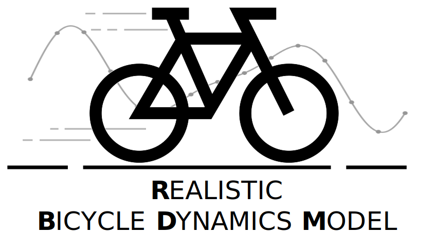

<p align="center">

</p>

----------------------

Contact: [Nico Ostendorf](nico.ostendorf@de.bosch.com)

The Realistic Bicycle Dynamics Model for the ["Simulation of Urban MObility" (SUMO)](https://sumo.dlr.de/) simulator is based on real-world bicycle data from the [SimRa](https://www.digital-future.berlin/forschung/projekte/simra/) dataset. 
The model implements realistic speed, acceleration, and deceleration behavior of bicycles in urban scenarios.

This implementation is based on [SUMO Version 1.8](https://github.com/eclipse-sumo/sumo/commits/v1_8_0). 
Please refer to the [SUMO wiki](https://sumo.dlr.de/docs/index.html) for further information on the simulator itself.

How to cite it:
----------------------

N. Ostendorf, K. Garlichs, and L. C. Wolf, “Enhancing Car-Following Models with Bike Dynamics for Improved Traffic Simulation,” in 2025 IEEE International Conference on Mobility, Operations, Services and Technologies (MOST)

Build and Installation
----------------------

The build and install steps for ubuntu are the same as for the standard SUMO versions:

        git clone https://github.com/boschresearch/RealisticBicycleDynamicsModel.git
        sudo apt-get install cmake python g++ libxerces-c-dev libfox-1.6-dev libgdal-dev libproj-dev libgl2ps-dev swig
        cd /path/to/model # please insert the correct directory name here
        export SUMO_HOME="$PWD"
        mkdir build/cmake-build && cd build/cmake-build
        cmake ../..
        make -j$(nproc)

For detailed build instructions have a look at [SUMO Documentation](https://sumo.dlr.de/docs/Developer/Main.html#build_instructions).


Usage
---------------

To use the model you need to modify your trips file.

First you need to add a new vType:

```
<vType id="bike" accel="4" decel="3.5" maxSpeed="13.5" sigma="0" emergencyDecel="4.9" length="1.9" width="0.6" minGap="0.3" color="1,1,0" vClass="bicycle" laneChangeModel="SL2015" carFollowModel="BicycleModel" latAlignment="arbitrary" lcCooperativeSpeed="0.5" minGapLat="0.3" lcTurnAlignmentDistance="5.0" />
```

To each trip in your trips file you need to append a so called bikeFactor. This should be randomly selected based on the Student’s t distribution with the parameters described in the paper. For example:

```
<trip id="bike0" type="bike" depart="0.00" departLane="best" departSpeed="max" from="-453082174" to="30419826#1" bikeFactor="0.7514752584567822" />
```

An example notebook for automatic modification of a trip file is [tools/modifyTrips.ipynb](https://github.com/boschresearch/RealisticBicycleDynamicsModel/blob/main/tools/modifyTrips.ipynb).


Bugs
----

Please use for bugs and requests the [GitHub bug tracking tool](https://github.com/boschresearch/RealisticBicycleDynamicsModel/issues). Before filing a bug, please consider to check with a current repository checkout whether the problem has already been fixed.

We welcome patches, pull requests and other contributions!


License
-------

Licensed under the [Eclipse Public License Version 2](https://github.com/boschresearch/RealisticBicycleDynamicsModel/blob/main/LICENSE).
